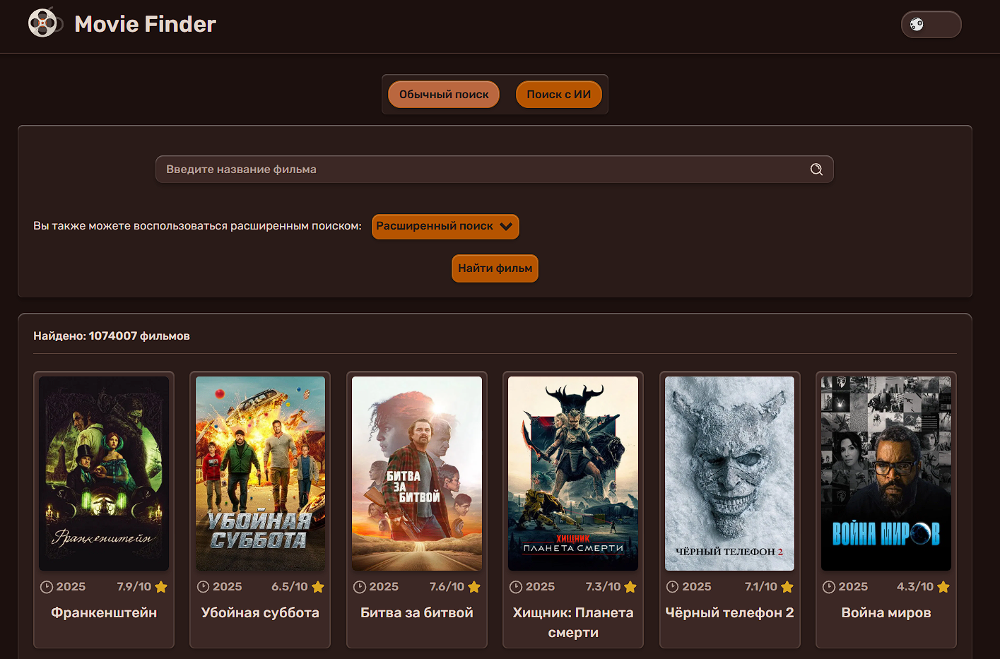
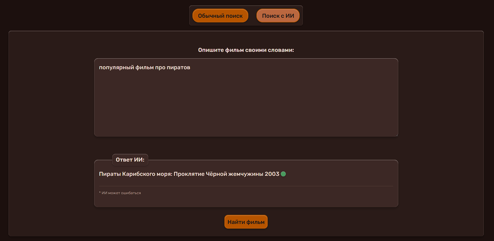
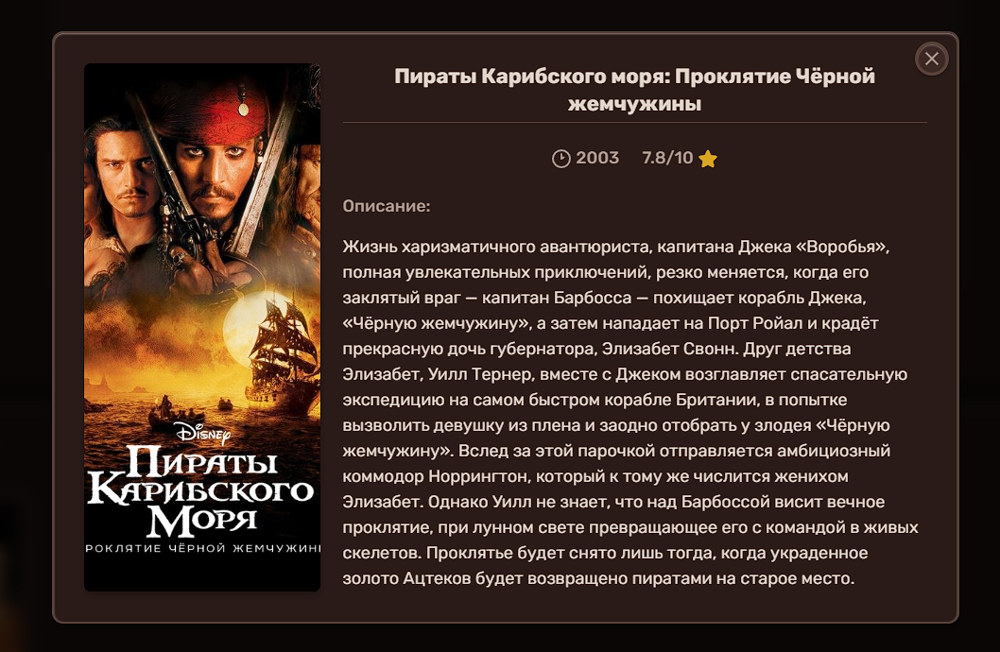

# Movie Finder with AI

## Цель проекта

Создание современного веб-приложения для поиска фильмов, которое объединяет традиционный поиск по базе данных с возможностями искусственного интеллекта. Проект демонстрирует интеграцию AI в повседневные задачи и показывает, как естественный язык может упростить взаимодействие с данными.

## Описание

Movie Finder with AI — это веб-приложение, которое позволяет искать фильмы двумя способами:

1. **Традиционный поиск** — поиск по названию фильма через базу данных TMDB
2. **AI-поиск** — описание фильма своими словами на естественном языке, например: "фильм про сны внутри снов" или "история о художнике, который рисует портреты в Париже"

Искусственный интеллект анализирует ваше описание, определяет о каком фильме идет речь, а затем автоматически выполняет поиск в базе данных TMDB, показывая вам результаты.

## Функционал

### Двухрежимный поиск
- **Ручной поиск**: традиционный поиск по названию фильма
- **AI-поиск**: описание фильма своими словами на естественном языке

### Фильтрация результатов
- Сортировка по популярности, рейтингу, дате выхода
- Фильтрация по жанрам
- Фильтрация по годам выпуска

### Детальная информация о фильмах
- Постер, название, год выпуска
- Рейтинг TMDB
- Подробное описание сюжета

### Адаптивный дизайн
- Полностью адаптивная верстка для всех устройств
- Темная и светлая темы оформления
- Сохранение выбранной темы в localStorage

### Удобный UX
- Индикаторы загрузки для длительных операций
- Информативные сообщения об ошибках
- Клавиатурная навигация и поддержка доступности

## Скриншоты

### Главная страница

### AI-поиск в действии

### Результаты поиска

### Детали фильма

## Используемые технологии

### TMDB API
[The Movie Database (TMDB)](https://www.themoviedb.org/) — крупнейшая база данных фильмов и сериалов, поддерживаемая сообществом. API предоставляет доступ к информации о фильмах, включая постеры, описания, рейтинги, жанры и другие метаданные.

В проекте используется для:
- Поиска фильмов по названию
- Получения детальной информации о фильмах
- Загрузки постеров и изображений

### Groq API
[Groq](https://groq.com/) — платформа для быстрого выполнения AI-моделей. Использует модели семейства LLaMA для обработки естественного языка.

В проекте используется для:
- Анализа пользовательских описаний фильмов на естественном языке
- Определения названия фильма по описанию сюжета, персонажей или других характеристик
- Преобразования неструктурированного текста в конкретные поисковые запросы

### Интеграция AI и базы данных
Приложение демонстрирует двухэтапный процесс:
1. AI (Groq) интерпретирует описание пользователя и идентифицирует фильм
2. Результат автоматически используется для точного поиска в TMDB API

Такой подход позволяет пользователю не вспоминать точное название фильма — достаточно описать сюжет, персонажей или ключевые моменты.

## Демо

🔗 [Открыть приложение](https://jake17-71.github.io/movie-finder/)

## Лицензия

Проект создан в образовательных целях.
